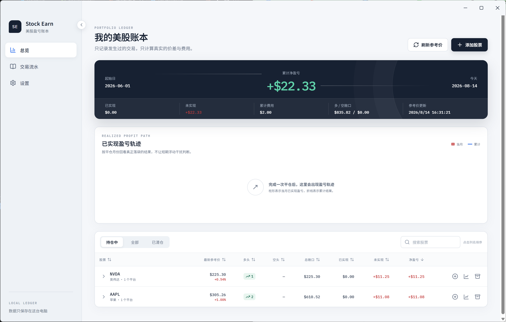

# Stock Earn 美股账本

一个纯本地运行的 Windows 美股盈亏账本，用来记录真实成交，并按 FIFO（先进先出）规则计算多头、空头、已实现盈亏、未实现盈亏和手续费。

Stock Earn 不连接券商账户，不自动下单，也不要求注册账号。除获取可选的市场行情外，账本数据始终保存在当前电脑。

> 当前版本：`0.1.0`。项目仍处于早期阶段，建议定期导出备份。



## 功能特性

- 支持多个交易平台，分别计算各平台的持仓与盈亏
- 支持多头、空头、加仓、部分平仓和碎股
- 使用 FIFO 规则匹配开仓批次
- 手动记录买卖价格、数量、手续费、成交时间和备注
- 自动判断开多、加多、平多、开空、加空和平空
- 汇总已实现盈亏、未实现盈亏、净盈亏、费用及多空敞口
- 展示按月与累计的已实现盈亏轨迹
- 查看单只股票的交易流水、日 K 线和买卖位置
- 可选择中国或美国市场习惯的盈亏颜色
- 支持账本导出、恢复及跨电脑迁移
- 可选接入 Twelve Data，获取最新参考价和历史日线

## 界面与使用流程

首次启动时，应用会引导完成三项设置：

1. 设置入市起始日
2. 选择是否填写 Twelve Data API Key
3. 添加第一个交易平台，例如 IBKR、富途或嘉信

完成初始化后，可以添加股票并录入交易。Twelve Data API Key 不是必需的；跳过后仍然可以记录交易和计算已实现盈亏，但未实现盈亏、持仓市值和日 K 线需要参考行情才能计算或展示。

## 盈亏计算规则

账本按“股票 + 交易平台”分别维护 FIFO 持仓队列，不会将不同平台的仓位互相抵消。

- 平多盈亏：`(卖出价 - 开仓价) × 数量 - 分摊手续费`
- 平空盈亏：`(开仓价 - 买回价) × 数量 - 分摊手续费`
- 未实现盈亏：使用最新参考价计算，并扣除尚未分摊的开仓手续费
- 净盈亏：`已实现盈亏 + 未实现盈亏`
- 交易日期按美东时间（America/New_York）判断

一笔交易不能直接穿过零仓位。例如，当前持有 10 股多仓时，不能用一笔卖出 15 股同时完成平多和开空；应拆成“卖出 10 股平多”和“卖出 5 股开空”两笔交易。

## 安装与本地开发

### 环境要求

- Windows 10/11（当前打包目标）
- Node.js 与 npm
- 网络连接仅在安装依赖或获取行情时需要

### 启动开发环境

```powershell
npm install
npm start
```

### 检查与测试

```powershell
npm test
npm run typecheck
```

### 构建 Windows 应用

```powershell
# 生成免安装应用目录
npm run package

# 生成 Squirrel 安装包和 ZIP
npm run make
```

构建产物位于 `out/`。当前版本未配置 Windows 代码签名，运行自行构建的安装包时可能会看到 SmartScreen 提示。

## 行情服务

应用使用 [Twelve Data](https://twelvedata.com/) 提供可选的最新参考价与历史日线：

- API Key 需要由用户自行申请并在“设置”中填写
- 保存前会先测试 API Key 是否可用
- 最新价格缓存超过 15 分钟后会被标记为过期
- 历史日线从账本设置的入市起始日开始同步
- 应用内限制为每分钟最多 8 个额度、每天最多 800 个额度

行情仅用于账本估值参考，可能存在延迟、缺失或服务商数据误差，不应作为交易下单依据。

## 本地数据与隐私

Windows 下的数据目录为：

```text
%APPDATA%\Stock Earn 美股账本\
```

通常对应：

```text
C:\Users\<你的用户名>\AppData\Roaming\Stock Earn 美股账本\
```

主要文件如下：

| 文件 | 内容 |
| --- | --- |
| `stock-earn.db` | 账本主数据库，包括平台、股票、交易、设置和行情缓存 |
| `stock-earn.db-wal` / `stock-earn.db-shm` | SQLite 运行时辅助文件 |
| `quote-key.bin` | 由 Electron `safeStorage` 调用 Windows 加密能力保存的行情 API Key |
| `backups/` | 从备份恢复前自动创建的当前账本副本 |

可以按 `Win + R`，输入以下内容直接打开数据目录：

```text
%APPDATA%\Stock Earn 美股账本
```

这些数据不在项目仓库内，正常执行 Git 提交或推送到 GitHub 时不会上传。不要把数据库、`quote-key.bin` 或手动导出的备份文件复制进项目目录后再提交。

## 备份、恢复与跨电脑迁移

在应用中打开“设置 → 本地备份”：

- “导出备份”会生成一个 `.stockearn.json` 文件
- “从备份恢复”会用备份内容替换当前账本
- 恢复前，应用会在本地 `backups/` 目录自动保存一份现有账本
- 备份包含设置、交易平台、股票、交易记录、参考价缓存和历史日线
- 备份不包含 Twelve Data API Key

在另一台电脑使用同一份数据时，只需在原电脑导出备份，再在新电脑中恢复该备份。迁移后请重新填写 API Key。

目前应用不提供云同步。两台电脑分别修改后，数据不会自动合并；需要自行确定哪一份账本为最新版本再导出、恢复。

## 技术栈

- Electron 43 + Electron Forge
- React 19 + TypeScript
- Vite
- Electron 内置 `node:sqlite`
- Decimal.js
- Zod
- TanStack Table
- Lightweight Charts + Recharts
- Radix UI + Lucide Icons
- Vitest

应用启用了渲染进程沙箱、上下文隔离并关闭 Node.js 集成；主进程 IPC 输入会在写入前进行校验。

## 项目结构

```text
src/
├─ main/       # SQLite、行情服务、备份与 Electron 主进程
├─ preload/    # 受控的渲染进程 API
├─ renderer/   # React 页面、组件与样式
└─ shared/     # 类型、输入校验与 FIFO 计算逻辑
```

## 常用命令

| 命令 | 说明 |
| --- | --- |
| `npm start` | 启动开发模式 |
| `npm test` | 运行单元测试 |
| `npm run test:watch` | 监听文件并持续运行测试 |
| `npm run typecheck` | 执行 TypeScript 类型检查 |
| `npm run package` | 生成免安装应用目录 |
| `npm run make` | 生成 Windows 安装包和 ZIP |

## 免责声明

Stock Earn 是个人交易记录与盈亏计算工具，不提供投资建议、税务建议或券商对账保证。正式申报或核对资产时，请以券商结单和专业意见为准。

## License

MIT
